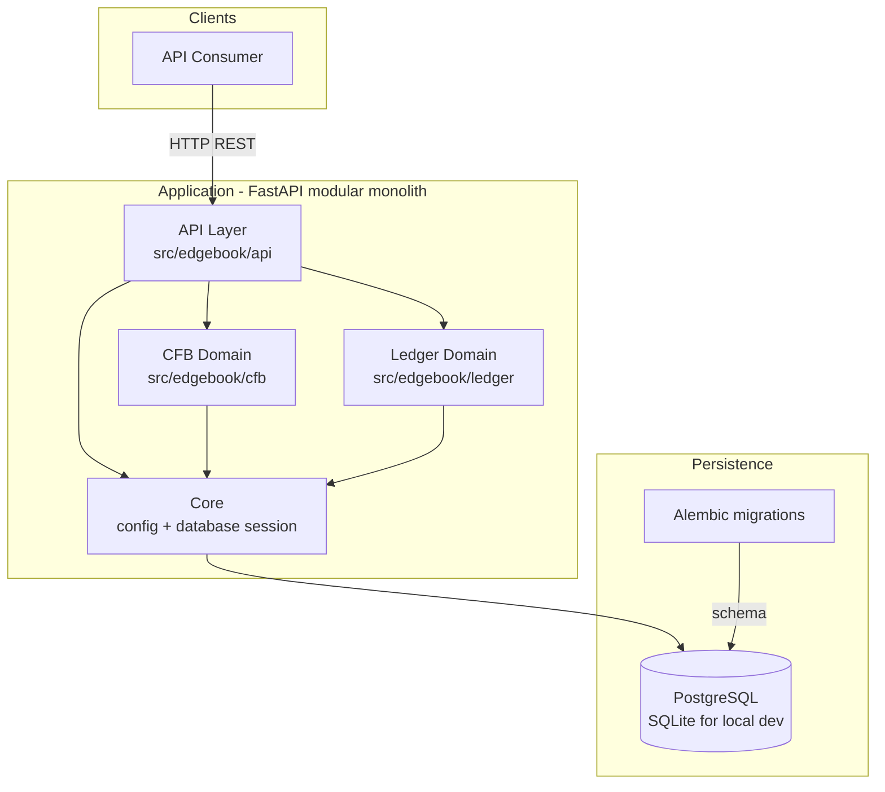

# System Overview

This document provides a high-level overview of the Edgebook architecture. Edgebook is a
**simulation-only college football paper-betting platform** built as a modular monolith.

## Architecture Diagram

## Core Design Principle: Strict Module Separation

The ledger accounting module (`src/edgebook/ledger/`) is **strictly isolated** from the
college-football domain module (`src/edgebook/cfb/`). The two never import from each other
directly. This keeps the double-entry ledger reusable for future paper-investing use cases
beyond sports betting, and confines CFB-specific rules to their own boundary.

The wagering application boundary (`src/edgebook/wagering/`) coordinates CFB state and
generic ledger postings in one database transaction.

## Components

### API Layer (`src/edgebook/api/`)
- **`accounts.py`** — Fictional account creation, deposits/withdrawals, and statement history.
- **`cfb.py`** — Manual intake of teams, games, markets, and American-odds quotes.
- **`wagering.py`** — Simulated bet placement and account bet history.
- **`analytics.py`** — Read-only account performance summaries, breakdowns, and chart series.
- **`ingestion/`** — Provider-neutral normalized feeds, immutable observations, and scheduler-safe sync commands.
- FastAPI provides automatic request validation and OpenAPI docs at `/docs`.

### CFB Domain (`src/edgebook/cfb/`)
- **Models:** `Team`, `Game`, `Market`, `MarketQuote`, score observations, and score resolutions.
- **Markets:** Spread, Moneyline, and Total with `HOME`/`AWAY`/`OVER`/`UNDER` selections.
- **Intake:** Manual entry remains available alongside multi-provider normalized-feed ingestion.
- **Odds:** Provider observations are retained without a canonical line; a bet snapshots an explicitly selected quote.
- **Corrections:** Final-score corrections append an audit record, reverse payout postings with
  `ADJUSTMENT` entries, and re-settle affected bets atomically.
- CFB intake never touches ledger balances.

### Wagering Boundary (`src/edgebook/wagering/`)
- **Models:** Durable bets with locked line, odds, stake, and pre-bet bankroll snapshots.
- **Placement:** Rejects bets from 30 minutes before kickoff and records `WAGER_STAKE`.
- **Settlement:** Applies moneyline, spread, and total rules and records `WAGER_PAYOUT`.
- **Analytics:** Computes ROI, return dispersion, allocation calibration, and ledger-replayed
  balance and drawdown series without mutating source data.
- **Review:** Creates asynchronous human-review tasks for rationale-bearing bets; review outcomes
  remain separate from settlement and financial metrics.
- **Atomicity:** Bet, score, and ledger changes commit or roll back together.

### Ledger Domain (`src/edgebook/ledger/`)
- **Models:** `Account`, `JournalEntry`, `Transaction`.
- **Double-entry:** Every balance change is a balanced set of signed postings between the
  user's `USER_ASSET` account and the internal `EQUITY` (simulation-capital) counterparty.
- **Immutable & append-only:** Postings and journal entries are never mutated.
- **Transaction types:** `DEPOSIT`, `WITHDRAWAL`, `WAGER_STAKE`, `WAGER_PAYOUT`, `ADJUSTMENT`.

### Core (`src/edgebook/core/`)
- **`config.py`** — Pydantic `Settings` (project name, database URL, etc.).
- **`database.py`** — SQLAlchemy session/engine setup and `get_db` dependency.

### Persistence
- **PostgreSQL 15+** is the system of record for production.
- **SQLite** is used for local development and the test suite.
- **Alembic** manages schema migrations (`alembic/versions/`).

## Money Representation

All monetary amounts are stored as **integer cents** (`_cents` columns) to avoid
floating-point rounding. The API accepts exact two-decimal decimal values and converts internally.

## Roadmap Context

This overview includes the completed Phase 1 manual flow, Phase 2 hardening, and Phase 3
analytics. Phase 4 now provides the source-agnostic ingestion boundary and conflict-safe
settlement workflow; production providers remain configuration work. Phase 5 provides the
human-review boundary; model execution is deferred. Authentication and authorization remain a
prerequisite before local operator APIs are exposed. See the
[Implementation Schedule](../implementation_schedule.md) for the full roadmap.
