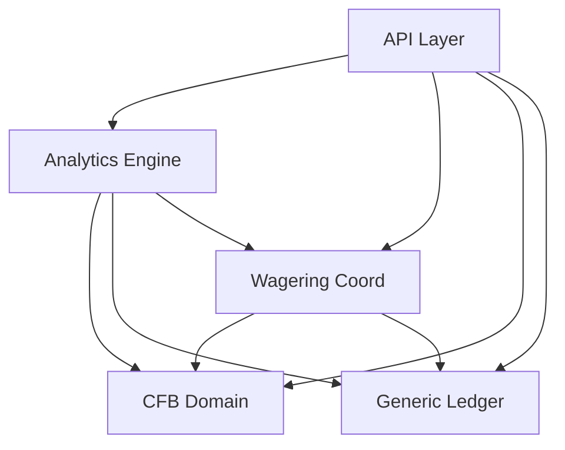

# Edgebook Product Manual & Developer Guide

Welcome to **Edgebook**, a simulation-only college football paper-betting platform. It allows enthusiasts to test bankroll allocation strategies, record wagers, input final scores, settle bets, and review allocation calibration without financial risk.

---

## 🎯 Product Overview

### Core Principles
* **Simulation-Only:** Edgebook does not process real money or connect to real-money wagering interfaces.
* **Separation of Concerns:** Generic double-entry simulation bookkeeping is kept strictly separate from college-football sports rules, making it easy to adapt the ledger for general investing or other sports.
* **Append-Only Invariant:** No transactions are ever deleted or updated. Game score corrections reverse prior wager payouts using negative offsetting ledger entries.

### User Persona & Core Stories
* **Dana the Disciplined Allocator:** Dana wants to evaluate allocation discipline and bankroll history without putting actual capital at risk.
* **Story 1 (Fictional Account):** Create a fictional account with a starting bankroll.
* **Story 2 (Simulated Wager):** Record spread, total, or moneyline bets with stakes, odds, and optional reasoning.
* **Story 3 (Audit Trail):** Bankroll balance updates atomically upon bet settlement, backed by an immutable ledger.
* **Story 4 (Sandbox Analytics):** View ROI, win rate, Sharpe ratio, and calibration statistics split by conviction and category.

---

## 🗺️ System Architecture

Edgebook is designed as a **modular monolith** with clean, acyclic dependency layers:



### Module Roles & Boundaries
* [`ledger`](file:///Users/connorkitchings/Desktop/Repositories/edgebook/src/edgebook/ledger) — Generic credit/debit bookkeeping. Decoupled and reusable.
* [`cfb`](file:///Users/connorkitchings/Desktop/Repositories/edgebook/src/edgebook/cfb) — Reusable catalog of teams, scheduled games, markets, and quotes. Pure domain, knows nothing of ledger or wagers.
* [`wagering`](file:///Users/connorkitchings/Desktop/Repositories/edgebook/src/edgebook/wagering) — Coordinative layer that places bets,Snapshots quotes, and settles wagers against the ledger.
* [`analytics`](file:///Users/connorkitchings/Desktop/Repositories/edgebook/src/edgebook/analytics) — Read-only performance calculations (ROI, Sharpe, drawdowns).
* [`ingestion`](file:///Users/connorkitchings/Desktop/Repositories/edgebook/src/edgebook/ingestion) — Multi-source feed synchronization engine that processes provider data and triggers automated settlement.

---

## ⚙️ Tech Stack & Local Operations

### Environment Requirements
* **Runtime:** Python >= 3.11.x (Pinned to 3.11 for compatibility with Pydantic core under 3.14).
* **Package Manager:** [uv](https://github.com/astral-sh/uv) >= 0.4.x.
* **Database:** PostgreSQL (production), SQLite (fallback local development).

### Developer Runbook
```bash
# 1. Sync Dependencies
uv sync

# 2. Database Migrations (Alembic)
uv run alembic upgrade head
uv run alembic revision --autogenerate -m "description"

# 3. Code Formatting & Linting (Ruff)
uv run ruff format .
uv run ruff check .

# 4. Running the Test Suite
uv run pytest

# 5. Launch Local Dev Server
uv run uvicorn edgebook.main:app --reload
```
